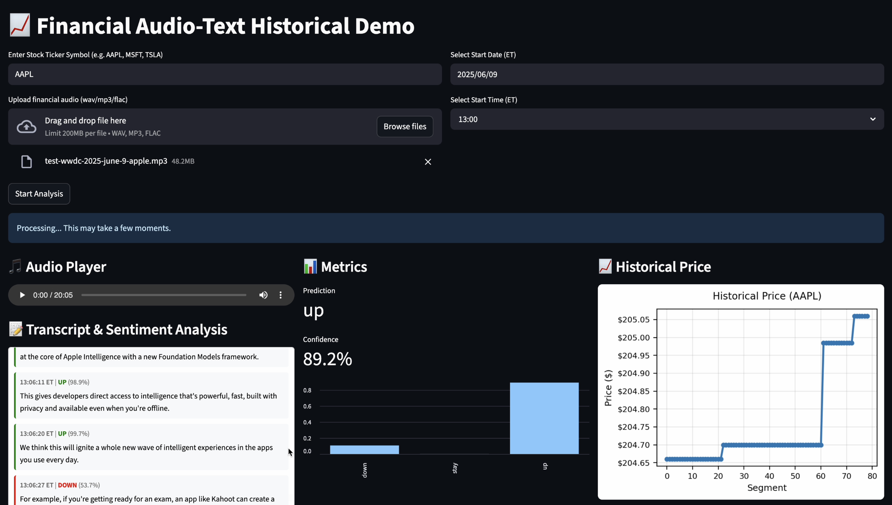

# FinEvent-MinuteLevel-Prediction

**During-Event Multi-Modal Financial Audio Analysis for Short-Term Stock Price Movement Prediction**

This repository contains the code, data processing pipeline, and demo application for our research on predicting minute-level stock price movements during financial events. Unlike prior work that relies on post-event transcripts, this project fuses **textual embeddings** and **audio prosodic features** to make **during-event predictions**.

---

## 🔑 Key Features

* **Multi-Modal Pipeline**: Combines text (Whisper + FinBERT) and audio (Wav2Vec2) embeddings.
* **Minute-Level Predictions**: Detects micro-reactions to financial statements in real time.
* **Streamlit Demo**: Upload financial audio and view synchronized stock movement predictions.
* **End-to-End Training**: Includes data preparation, feature extraction, classifier training, and deployment.

---

## ⚙️ Installation

Dependencies include:

* `torch`, `transformers` (Whisper, FinBERT, Wav2Vec2)
* `scikit-learn` (classification, preprocessing)
* `streamlit` (demo app)
* `pandas`, `numpy`, `matplotlib`

---

## 🚀 Usage

### Step 1. Prepare Event Metadata

Ensure you have the seed file:

```
market-hours-youtube-events-seed.csv
```

This file should contain event timestamps, tickers, and video links.

### Step 2. Preprocess Data

```bash
python prep_data.py
```

### Step 3. Extract Multi-Modal Embeddings

```bash
python process_data.py
```

### Step 4. Train Classifier

```bash
python train.py
```

Trains the MLP classifier with concatenated text + audio embeddings.

### Step 5. Run Demo Application

```bash
python app.py
```

Open the Streamlit interface in your browser to upload financial audio and view predictions with synchronized stock price plots.

---

## 📊 Example Demo

The Streamlit app workflow:

1. Upload an earnings call or conference audio file.
2. Automatic segmentation + Whisper transcription.
3. Sentence-level predictions (up / down / neutral).
4. Interactive visualization with stock price charts.



## 📧 Contact

For questions, please reach out to **[dongimlee@uchicago.edu](mailto:dongimlee@uchicago.edu)** or open an issue on this repository.
